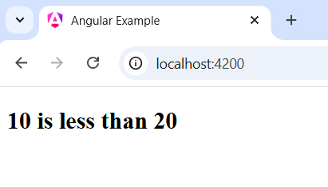
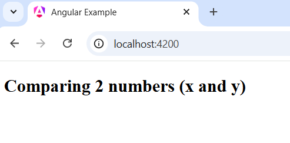
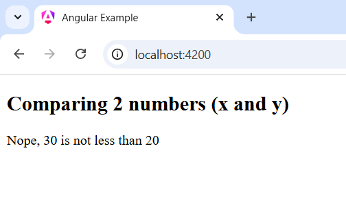
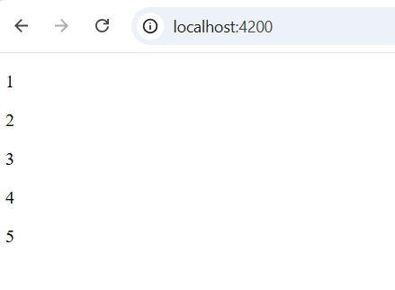
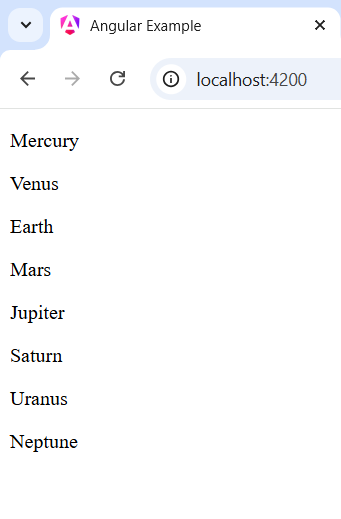

## Angular Control Flow Statements

In this post we are going to learn about Angular new control flow statements like @if, @for, @switch etc. 

Note: After Angular 17, it is recommended to use new control flow statements like @if, @for, @switch. And from Angular version 20+ the ngIf, ngFor, ngSwitch have been deprecated.

@if: It refers a conditional block. In order to conditionally rendering elements, you can use @if control flow statements.

Syntax:

```
@if(condition){
    //code-block
}
//with else 
@if(condition){
    //code block
} 
@else{
    //code-block
}
//with else if (another condition to check)
@if(condition){
    //code-block will render
    //if the condition is true
}
@else if(codition){
    //code-block will render when the if condition is false
}
@else{
    //code block
    //this will always render if the above (if and else if) conditions become false
}
```

Note: You can write write multiple @else-if conditions, even nested @if conditions, if required


## Simple Example that Demonstrate @if, @else if and @else conditions

Let's compare two numbers using @if statement.

```
//app.component.ts
export class App{
  x: number = 10;
  y: number = 20;
}
//app.component.html (or, you can use inline html)
<div>
    @if (x < y) {
        <h2>{{x}} is less than {{y}}</h2>
    }
</div>
```

Now, after running the application, you will see the following window in your browser.


Note: app.component.ts or app.component.html is not the default file name any more. You can keep them or omit them.

What if, x is greater than y? Nothing will be executed then. Because, @if block will only render when the condition is true.

```
//app.ts (component file)
export class App{
  x: number = 30;
  y: number = 20;
}
//app.html (template file)
<div>
    <h2>Comparing 2 numbers (x and y)</h2>
    @if (x < y) {
        <h2>{{x}} is less than {{y}}</h2>
    }
</div>
```
Output should be: 


In this case, the @else statement will come handy. Like, we want to show something when the @if condition is not true. Such as,

```
<div>
    <h2>Comparing 2 numbers (x and y)</h2>
    @if (x < y) {
        <p>{{x}} is less than {{y}}</p>
    } @else{
        <p>Nope, {{x}} is not less than {{y}}</p>
    }
</div>
```

Now you will see, the @else block, if the @if condition becomes false. Note, it is always good practice to use @else block in case if something does not match in @if block, your application will yet show something to the visitors.



## Using @else if Statements

When you have many codes to check and render only one thing, then you can add as many as @else if blocks after if block. Such as,

```
//app.ts (component file)
export class App{
  x: number = 10; //change the number and see what renders in browser.
}
//app.html (template file)
<div>
    <h2>Check {{x}} is a positive, negative, even or odd number</h2>
    @if (x > 0 && x % 2 === 0) {
        <p>{{x}} is a positive and even num</p>
    } @else if(x > 0 && x % 2 !==0){
        <p>{{x}} is odd number</p>
    }
    @else if (x < 0) {
        <p>{{x}} is a negative number</p>
    } @else {
        <p>{{x}} is not a number</p>
    }
</div>
```

Note: It is recommended not to use high logic in template file, it should be simple.

## Angular @for Loop

The @for loop in angular is used for iterating things. Such as, when you have a list of items, numbers, products etc. and you want to show them one after another, use @for statement. It's called looping statement in backend programming languages. Such as, let's iterate the following array of numbers.

```
export class App{
  //declare an array
  numbers: number[] = [1, 2, 3, 4, 5];
}
//template file
<div>
    @for(num of numbers; track $index){ <!--We basically use item.id for identify the elements-->
        <p>{{num}}</p>
    }
</div>
```


Note: Using track is mandatory, it basically holds the state of the element and helps angular identify the items while rendering list of elements.

Look at the following example and see how we track the id of each elements.

```
//component file
export class App{
  
  planets = [
    { id: 1, name: 'Mercury' },
    { id: 2, name: 'Venus' },
    { id: 3, name: 'Earth' },
    { id: 4, name: 'Mars' },
    { id: 5, name: 'Jupiter' },
    { id: 6, name: 'Saturn' },
    { id: 7, name: 'Uranus' },
    { id: 8, name: 'Neptune' }
  ];
}
//template file
<div>
    @for(planet of planets; track planet.id){
        <p>{{planet.name}}</p>
    }
</div>
```


Okay, what if you do not have id or any other reference to use in track? 

 ***If no other option is available, you can use the item itself as a tracking key. This tells Angular to track the item by its reference identity using the triple-equals operator (===). Avoid this option whenever possible as it can lead to significantly slower rendering updates, as Angular has no way to map which data item corresponds to which DOM nodes.***


Hence, angular supports the following Contextual variables to use in @for loop.

<table style={{width: 100%}} border="0">
<tr>
<th>Variables</th>
<th>Meaning</th>
</tr>

<tr>
<td>$count</td>
<td>Number of items in a collection iterated over</td>
</tr>

<tr>
<td>$index</td>
<td>Index of the current row</td>
</tr>

<tr>
<td>$first</td>
<td>Whether the current row is the first row</td>
</tr>

<tr>
<td>$last</td>
<td>Whether the current row is the last row</td>
</tr>

<tr>
<td>even</td>
<td>Whether the current row index is even</td>
</tr>

<tr>
<td>odd</td>
<td>Whether the current row index is odd</td>
</tr>
</table>