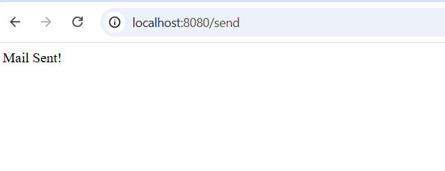
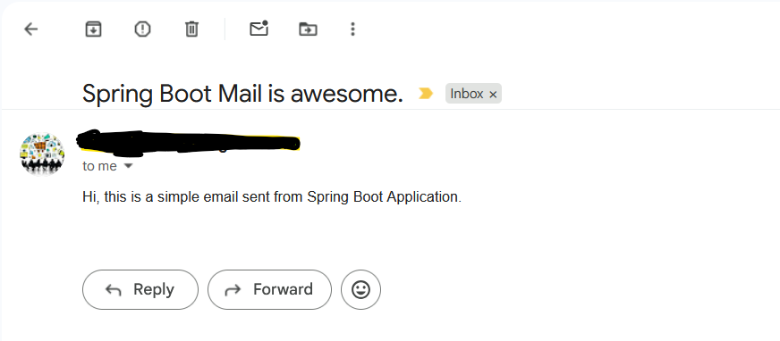
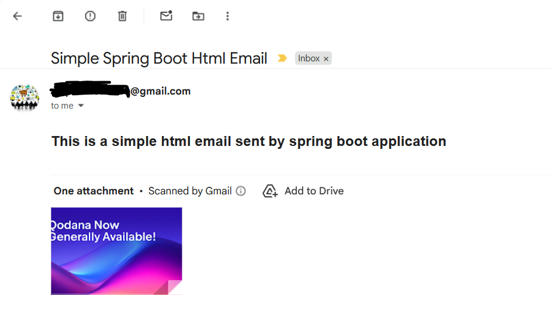

## Sending Emails Using Spring Boot Mail

In this tutorial we are going to see how to send emails from our spring boot application using spring boot mails. I usually do not use spring boot mail to send emails from my application but it is sometimes necessary to send emails from your application.

## Basic Requirements

First of all add the following spring boot starter mail dependency in your classPath like pom.xml file.

```
<dependency>
    <groupId>org.springframework.boot</groupId>
    <artifactId>spring-boot-starter-mail</artifactId>
</dependency>
```

It provides JavaMailSender interface out of the box and that helps to send emails easily. When you add spring-boot-starter-mail dependency, you can access the following two class that helps to create text based email and html emails.

-  **SimpleMailMessage:** used to send text based emails.
-  **MimeMessage + MimeMessageHelper:** used to send html emails and attachments.

Now, in your application properties file, you have to provide gmail (if you use) smtp server information. Such as,

**application.properties**
```
spring.mail.host=smtp.gmail.com
spring.mail.port=587
spring.mail.username=your-email@gmail.com
spring.mail.password=your-app-password # you have to generate one

spring.mail.properties.mail.smtp.auth=true
spring.mail.properties.mail.smtp.starttls.enable=true
```

**Note** If you use different email service provides like sendGrid, Aweber, GetResponse, Kit or Aws SES (Amazon simple mail service) then you have to change the above properties file according to their service configurations.

## Sending Raw text based email

However, now create a simple MailService class with the following content.

**MailService.class**
```
package com.zetpot;

import jakarta.mail.internet.MimeMessage;
import org.springframework.mail.javamail.MimeMessageHelper;
import org.springframework.stereotype.Service;

import org.springframework.beans.factory.annotation.Autowired;
import org.springframework.mail.SimpleMailMessage;
import org.springframework.mail.javamail.JavaMailSender;

@Service
public class MailService {

    @Autowired
    private JavaMailSender mailSender;

    public void sendEmail(String to, String subject, String body) {

        SimpleMailMessage message = new SimpleMailMessage();
        message.setTo(to);
        message.setSubject(subject);
        message.setText(body);
        message.setFrom("your-email-address");

        mailSender.send(message);
    }

    //html email
    public void sendHtmlEmail(String to, String subject, String body) throws  Exception{
        MimeMessage message = mailSender.createMimeMessage();
        MimeMessageHelper helper = new MimeMessageHelper(message, true);

        helper.setTo(to);
        helper.setSubject(subject);
        helper.setText(body, true);
        helper.setFrom("smpahmed9830@gmail.com");

        mailSender.send(message);
    }
}
```

Here, I have inject the JavaMailSender interface that will be responsible sending emails from my application. Then we have declared a method called MailSend with three parameters.

```
 public void sendEmail(String to, String subject, String body){
    //...
 }
```
Here, **to** parameter will be the email address where we are going to send emails, I mean **recipient** email address, subject is the email subject and **body** is the email body.

Then, in it We have instantiated SimpleMailMessage class and used its core setter methods like **sendTo**, 
- **setSubject**, **setText** and **setFrom** in order create emails with proper attributes.

- **setTo()**: used to set the email recipient email address.
- **setSubject**: used to set subject of the email.
- **setText()**: used for email body (raw text)
- **setFrom**: used to set the sender email address.

At last we have called the MailSender **send** method to send the email to the recipient.

Now, create a controller class that will be used writing a simple email and helps to send emails to exact recipient.

**MailController.java**
```
package com.zetpot;

import org.springframework.beans.factory.annotation.Autowired;
import org.springframework.web.bind.annotation.GetMapping;
import org.springframework.web.bind.annotation.RestController;

@RestController
public class MailController {

    @Autowired
    private MailService mailService;

    @GetMapping("/send")
    public String sendMail() {
        mailService.sendEmail(
                "receiver-email-address",
                "Spring Boot Mail is awesome.",
                "Hi, this is a simple email sent from Spring Boot Application."
        );
        return "Mail Sent!"; //when you call the localhost:8080/send you see this text.
    }
}
```
Here you can see, we have inject the MailService class created just now, and call the **sendEmail** method with appropriate arguments.

Now, if you run the application, and visit: localhost:8080/send uri, you will see the following message



it means, we sent the email to the exact recipient. For this app, I used two different email address of mine. So, if you open your mailbox now, you will see this email:



## Sending Html Emails

Likewise raw text based emails, we can also send html emails plus attachments. For this, we have to use **MimeMessage** and **MimeMessageHelper** class in order to send html emails and attachments. For sending attachments (like image, files etc.) we have to use the **addAttachment** method with the appropriate file name.

Let's create another method in the **MailService** class that will use **MimeMessage** and **MimeMessageHelper** to send html emails + attachments.

**MailService.java**
```
//html email
    public void sendHtmlEmail(String to, String subject, String body) throws  Exception{
        MimeMessage message = mailSender.createMimeMessage();
        MimeMessageHelper helper = new MimeMessageHelper(message, true); //true is required for attachments

        helper.setTo(to);
        helper.setSubject(subject);
        helper.setText(body, true);
        //attachment
        helper.addAttachment("demo.png", new ClassPathResource("static/demo.png"));
        helper.setFrom("smpahmed9830@gmail.com");

        mailSender.send(message);
    }
```

And then call the sendHtmlEmail() method from the controller class with a new getMapping annotation.

**MailController.java**
```
@GetMapping("/html-send")
    public String sendHtmlEmail() throws Exception {
        mailService.sendHtmlEmail(
                "shakilmith2@gmail.com",
                "Simple Spring Boot Html Email",
                "<div><h2>This is a simple html email sent by spring boot application</h2></div>"
        );
        return "Email sent";
    }
```

If everything is going well, you will see the rest response **Email Sent** if you visit /html-send uri. Now, if you open your mailbox, surely you will get the following email with the attachment. 



Hope, this tutorial will help you to understand how to send emails from your spring boot application.

Thanks and kind regards.
